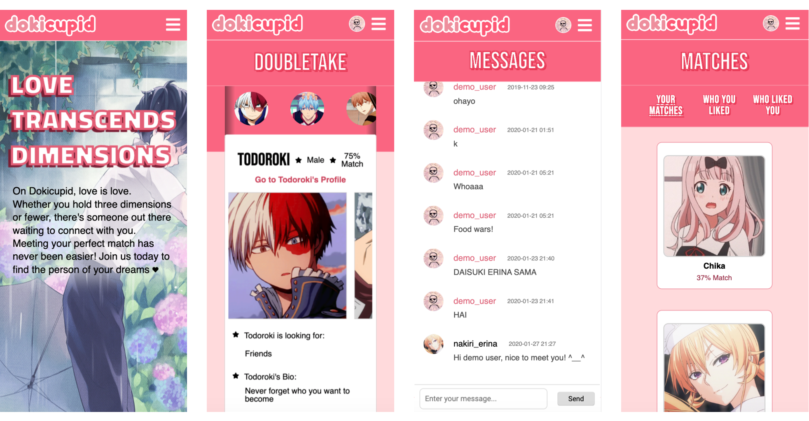

Jenode Nakamoto

# DokiCupid  (°◡° ♡)

### [Live Link](https://dokicupid.herokuapp.com/)

Welcome to **DokiCupid**, a dating app designed for anime characters!

DokiCupid is a clone of the popular dating site OkCupid. The Japanese term *"doki-doki"* describes the sound of one's beating heart and is often used to express excited feelings of love. 

DokiCupid features **user profiles, matchmaking, filtered search, and instant-messaging** between users. 

This application utilizes Rails and Postgres on the back-end, and React/Redux to manage the front-end. 

*Note: DokiCupid was a two-week project submitted as part of App Academy's full-stack curriculum.*
アニメキャラクター向けにデザインされたデートアプリ** DokiCupid**へようこそ！

DokiCupidは人気の出会い系サイトOkCupidのレプリカです。

DokiCupidは、**ユーザープロファイル、マッチメイキング、フィルタリングされた検索、ユーザー間のインスタントメッセージング**機能を提供します。

このアプリケーションは、バックエンドでRailsとPostgresを使用し、フロントエンドを管理するためにReact / Reduxを使用します。

*注：DokiCupidは、App Academy全体のスタックカリキュラムの一部として提出された2週間のプロジェクトでした。 *


*Update (02/05/20): DokiCupid is now mobile-friendly!*




---

## Technologies Used
1. Javascript
2. Ruby on Rails
3. PostgreSQL 
4. HTML 
5. CSS/SCSS 

## Libraries:
1. React.js
2. Redux 
3. Rails ActionCable for real-time messaging
3. jQuery for AJAX API requests
4. AWS S3 buckets for user avatar and profile photos 
5. BCrypt for User Authentication
6. NPM zipcodes to calculate distance between users


## Homepage (Doubletake)
After logging in, users are greeted with the **Doubletake** page which displays profile previews for users that the current user has not yet matched with. Users can see their match percentage with each displayed user and have the option to visit that user's profile. 
ログインすると、現在のユーザーとまだ一致していないユーザーのプロフィール プレビューを表示する **Doubletake** ページが表示されます。 ユーザーには、表示された各ユーザーとの一致率を表示し、そのユーザーのプロファイルにアクセスするオプションがあります。


## Explore and Search
The **Explore** page gives previews of all user profiles for users who are not yet matched with the current user, along with the distance from and compatibility rating with each user. 

The **Search** page allows a user to filter prospective matches by tags including specific personality traits, gender identification, and what the other user is "looking for" on this app. Multiple tags may be specified at one time, and the results will display users that meet all of these requirements. Users can also choose to sort these results by compatibility percentage in increasing or decreasing order.


A majority of my React components relied on knowing who the current user was already matched with, who they had previously "liked", and which users had "liked" them, in order to decide which information would be displayed. If the state did not already hold this information, a `GET` request was made to `/api/matches`.
**検索**ページには、現在のユーザーとまだ一致していないユーザーのすべてのユーザープロファイルのプレビューが、各ユーザーとの距離と互換性の評価とともに表示されます。

**検索**ページを使用すると、特定の性格属性、性別の識別、および他のユーザーが、このアプリで「検索」項目を含むタグで予想される一致をフィルタリングできます。 一度に複数のタグを指定できます。結果には、これらすべての要件を満たすユーザーが表示されます。 ユーザーは、互換性の割合に応じて昇順または降順でこれらの結果を並べ替えることもできます。


ほとんどのReactコンポーネントは、現在のユーザーがすでに一致している人、以前に「良い」人、「良い」人を知って表示する情報を決定することに頼っていました。 状態がこの情報をまだ保持していない場合は、 `/api/matches` に対して `GET` 要求が行われました。
```ruby
# app/controllers/api/matches_controller.rb
class Api::MatchesController < ApplicationController
  def index  
    @matched_users = current_user.matched_users
    @who_liked_you = current_user.requesting_users
    @who_you_liked = current_user.requested_users
  end
end 
```
The methods above called on `current_user` refer to methods I defined on the `User` model, such as the following:

```ruby
# app/models/user.rb
class User < ApplicationRecord
  def matches 
    Match.where(
      "(user_id = ? OR requested_user_id = ?) AND is_matched = ?",
      self.id, self.id, true
    )
  end 
  
  def matched_users 
    matches = self.matches
    matched_users = []
    matches.each do |match|
      if match.user_id == self.id 
        matched_users << User.find(match.requested_user_id)
      else 
        matched_users << User.find(match.user_id)
      end
    end
    matched_users
  end
end
```

## User Profiles 
When visiting one's own profile page, a user can choose to view, edit, or delete their profile. When editing, users can also attach more photos for their profile or delete any existing photos.

When users visit other users' profiles, they can "like", or request to be matched with, the user they are viewing. If the requested user chooses to "like" them back, a match is created which allows the two users to send messages to one another. 
自分のプロフィールページにアクセスすると、ユーザーは自分のプロフィールを表示、編集、削除できます。 編集すると、ユーザーはプロフィールに追加の写真を添付したり、既存の写真を削除したりできます。

ユーザーが他のユーザーのプロフィールにアクセスすると、表示しているユーザーに「いいね」をタップしたり、一致を要求したりできます。 要求されたユーザーが再び「いいね」を選択すると、2人のユーザーが互いにメッセージを送信できる一致が生成されます。


## Matches and Messaging
At the **Matches** page, users can see who they are currently matched with, who they "liked", and who "liked" them. When two users mutually "like" each other, the match is created, and one of the users can start a conversation with the other on the **Messages** page. Real-time chat between matched users is implemented using Action Cable in Rails. 
**マッチ**ページでは、ユーザーは現在誰と一致しているのか、誰に「いいね」を押したのか、誰が「いいね」を押したのかを確認できます。 2人のユーザーが互いに「いいね」を表示すると、一致が作成され、ユーザーの1人が**メッセージ**ページで他のユーザーと会話を開始できるようになります。 一致するユーザー間のリアルタイムチャットは、RailsのAction Cableを使用して実装されます。


#### Handling Conversations 
Because only one conversation should exist in conversations table of the database for a pair of matched users, I wrote a scope method `:between` in the `Conversation` model to be used when attempting to create a conversation at the controller. If one already exists in the database, the existing one is returned; if an existing conversation is not found, the method creates a new conversation between the two users and returns that conversation.
#### 会話処理
一致するユーザーのペアについて、データベース会話テーブルには1つの会話しか存在しないため、コントローラで会話を作成しようとしたときに使用する `Conversation`モデルに `：between`スコープメソッドを作成しました。 。 データベースにすでに存在する場合は、既存のエントリが返されます。 既存の会話がない場合、メソッドは2つのユーザー間で新しい会話を作成し、会話を返します。

```ruby
# app/controllers/api/conversations_controller.rb
def create
  if Conversation.between(
      conversation_params[:sender_id], conversation_params[:recipient_id]
    ).present?
    @conversation = Conversation.between(
      conversation_params[:sender_id],
      conversation_params[:recipient_id]
    ).first
  else
    @conversation = Conversation.create!(conversation_params)
  end
  render :show
end

```
```ruby
# app/models/conversation.rb
scope :between, -> (sender_id, recipient_id) do 
    where(
      "(conversations.sender_id = ? AND conversations.recipient_id = ?) OR (conversations.sender_id = ? AND conversations.recipient_id = ?)", 
      sender_id, recipient_id, recipient_id, sender_id
    )
end
```

#### Real-time Messaging 
One of the more challenging areas of this project was configuring Action Cable for real-time messaging.

In `MessagesChannel`, I defined a method `create` that takes in data and creates a message in the database with that data. Then, it broadcasts the `socket` object to the `"messages_channel"` referenced in the `subscribed` method.
####リアルタイムメッセージング
このプロジェクトで最も困難な分野の1つは、リアルタイムメッセージング用のアクションケーブルを設定することでした。

`MessagesChannel`からデータを取得し、そのデータでデータベースにメッセージを生成する`create`メソッドを定義しました。 次に、 `subscribed`メソッドが参照する `` messages_channel ''に `socket`オブジェクトをブロードキャストします。

```ruby
# app/channels/messages_channel.rb
class MessagesChannel < ApplicationCable::Channel  
  def subscribed
    stream_for 'messages_channel' 
  end

  def create(data) 
    message = Message.create(
      body: data["body"], 
      user_id: data["user_id"], 
      conversation_id: data["conversation_id"]
    )
    socket = { 
      id: message.id, 
      conversation_id: message.conversation_id, 
      body: message.body, 
      user_id: message.user_id, 
      read: message.read, 
      created_at: message.created_at 
    }
    MessagesChannel.broadcast_to("messages_channel", socket)
  end
end  
```

In the `MessageShow` component below, `this.createSocket` is called once the component mounts. `createSocket` then sets `this.messages` to be the subscription that is created. We set the channel to be the `MessagesChannel` shown above, and state that when we receive data (a new message), we want to add that message to `this.state.messageLogs` and `setState` to update what is displayed to the user. 

```javascript
// frontend/components/messages/messages_show.jsx
class MessagesShow extends React.Component {
  componentDidMount() {
     this.createSocket();
  }
   
  createSocket() {
    this.messages = App.cable.subscriptions.create({
      channel: 'MessagesChannel'
    }, {
      connected: () => { },
      received: (data) => {
        let messageLogs = this.state.messageLogs;
        messageLogs.push(data);
        this.setState({ messageLogs: messageLogs })
      },
      create: function (messageContent) {
        this.perform('create', 
          messageContent
        );
      }
    });
  }
  
  handleSendEvent(e) {
    e.preventDefault();
    this.messages.create({
      body: this.state.body, 
      conversation_id: this.state.conversationId, 
      user_id: this.state.userId
    });
    this.setState({ body: "" });
  }
}

```
I also defined a method `create` on `this.messages` which calls `handleSendEvent` with our new to-be-sent message. When the user hit the enter key or clicks the send button to submit their message, we call the `create` function passing in the `messageContent` we want to send to the `MessagesChannel`'s `create` method. 

---

### Future Directions
1. Display errors for Profile Form create/edit, and other relevant errors (only login/signup errors currently)
2. Use Google Maps API for accurate distance calculation
3. Add more personality quiz questions for more specific compatibility ratings
4. Notifications for new messages, matches, and likes
5. Sign up by email and validate email before using site

   また、新しい to-be-sent メッセージで `handleSendEvent` を呼び出す `this.messages` に `create` メソッドを定義しました。 ユーザーがEnterキーを押すか、送信ボタンをクリックしてメッセージを送信すると、 `MessagesChannel`の `create`メソッドに送信したい `messageContent`を渡す `create`関数が呼び出されます。

---

###将来の方向
1.プロファイルフォームの作成/編集エラーおよびその他の関連エラーの表示（現在のログイン/登録エラーのみ）
2. 正確な距離計算に Google Maps API を使用する
3. より具体的な相性評価のためのより個性クイズ質問を追加
4. 新しいメッセージ、マッチ、良い通知
5. サイト利用前メールで会員登録及びメール認証
# My-Date-APP

# My-Date-APP
kakashinakamoto0822@gmail.com


